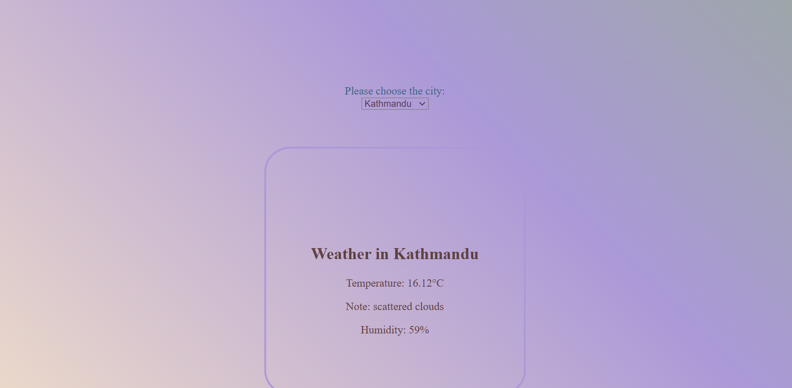

# Weather App
Basic Web-App that shows weather information of different cities.

## More
- Displays weather information of different cities.
- Plenty of Options.
- Looks asthetic AF.

## Made using

- **HTML**: Basic skeleton for the App.
- **CSS**: To style i.e add colors, depth and sizes.
- **JavaScript**: To obtain the information and fetch the data from API. 

## Usage

1. Just normal cloning 
2. Open the folder
3. Checkout the App on weather.html

## Screenshot

